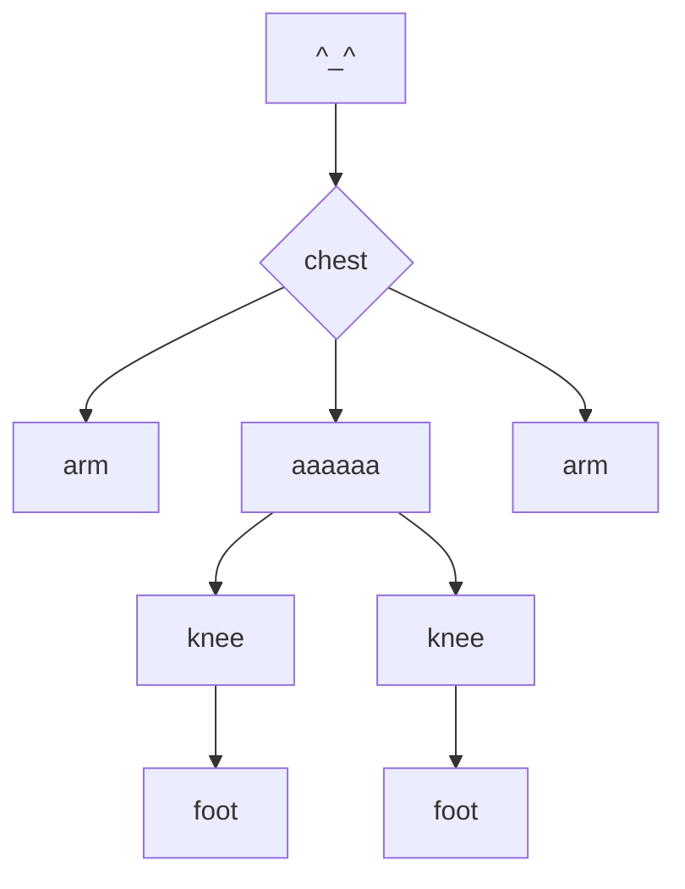

# :smile:Hi, I am JEEWOO KIM:smile:

&nbsp;&nbsp;&nbsp;&nbsp;&nbsp;&nbsp;&nbsp;&nbsp;&nbsp;&nbsp;&nbsp;&nbsp;&nbsp;&nbsp;&nbsp;&nbsp;&nbsp;&nbsp;&nbsp;&nbsp;&nbsp;&nbsp;&nbsp;***this is me***

## Random Image

* ### link
&nbsp;&nbsp;&nbsp;&nbsp;&nbsp;&nbsp;&nbsp;&nbsp;[random image](https://picsum.photos/200/300)
* ### example

* ### more about
&nbsp;&nbsp;&nbsp;&nbsp;&nbsp;&nbsp;&nbsp;&nbsp;[Lorem Picsum](https://picsum.photos/)

## Games I Usually Play
* fps
	* overwatch
	* valrorant
	* apex
* coop
	* repo
	* how to fish

## What I wanna learn this semester
* [ ] Principles When Building Project with AI
* [ ] Database
* [ ] Python Libraries like Numpy
